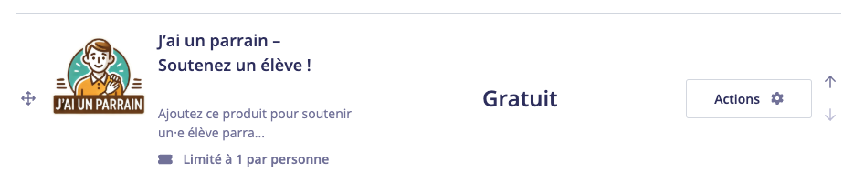
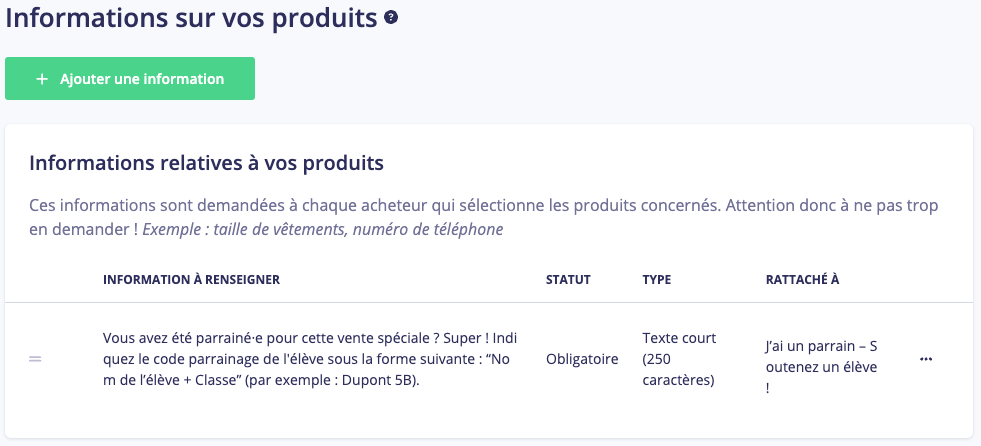

# Rapport de Ventes Helloasso

Ce projet est un script Python permettant de générer des rapports de ventes détaillés à partir de l'API Helloasso.

## Table des Matières

1. [Présentation du Projet](#présentation-du-projet)
2. [Fonctionnalités](#fonctionnalités)
3. [Installation](#installation)
4. [Configuration](#configuration)
5. [Utilisation](#utilisation)
6. [Gestion des Codes Parrains](#gestion-des-codes-parrains)
7. [Contribution](#contribution)
8. [Licence](#licence)

## Présentation du Projet

Le Rapport de Ventes Helloasso est un script Python conçu pour automatiser la récupération, l’analyse et la distribution des données de ventes via l’API Helloasso. Il permet de générer des résumés de ventes, des graphiques, des fichiers CSV et d’envoyer des rapports par email de manière régulière.

## Fonctionnalités

- Récupération des commandes via l'API Helloasso.
- Calcul du chiffre d'affaires, des bénéfices et des statistiques par produit.
- Génération de fichiers CSV pour un suivi détaillé.
- Envoi d'un email avec un résumé HTML et des fichiers attachés.
- Graphique du chiffre d'affaires par jour inclus dans l'email.

## Installation

1. **Cloner le dépôt :**

```bash
git clone https://github.com/shigaepouyen/Helloasso-report.git
cd Helloasso-report
```

2. **Créer un environnement virtuel :**

Il est recommandé d'utiliser un environnement virtuel pour gérer les dépendances du projet.

```bash
python3 -m venv venv
source venv/bin/activate  # Sous Windows : venv\Scripts\activate
```

3. **Installer les dépendances :**

```bash
pip install -r requirements.txt
```

## Configuration

Avant d'exécuter le script, vous devez configurer le fichier `config.ini` :

```ini
[Helloasso]
client_id = VOTRE_CLIENT_ID
client_secret = VOTRE_CLIENT_SECRET
organization_slug = VOTRE_ORGANIZATION_SLUG
operation = NOM_DE_L_OPERATION

[smtp]
server = smtp.example.com
port = 465
user = votre_email@example.com
password = votre_mot_de_passe

[email]
recipient = destinataire@example.com

[products]
Produit1 = prix_de_vente,cout_de_revient
Produit2 = prix_de_vente,cout_de_revient
```

## Utilisation

1. **Exécuter le script :**

```bash
python main.py
```

2. **Résultats :**

- Les rapports sont enregistrés au format CSV.
- Un email est envoyé avec les statistiques détaillées.

### Exemple de rapport des ventes :
| Produit      | Quantité | Chiffre d'affaires (€) | Bénéfice (€) | Nombre d'acheteurs | Moyenne produits/acheteur |
|--------------|----------|-------------------------|--------------|---------------------|---------------------------|
| Produit A    | 25       | 500.00                 | 250.00       | 15                  | 1.67                      |
| Produit B    | 10       | 200.00                 | 100.00       | 8                   | 1.25                      |
| Produit C    | 5        | 75.00                  | 50.00        | 5                   | 1.00                      |
| **Total**    |          | **775.00**             | **400.00**   |                     |                           |

## Gestion des Codes Parrains

Le script permet de suivre et d'analyser les performances des codes parrains utilisés dans les commandes. Ces codes permettent d'identifier les acheteurs parrainés et de calculer leur contribution aux ventes totales.

### Fonctionnalités liées aux codes parrains :

1. **Paramétrage dans Helloasso :**
   - Un **code parrain** doit être configuré comme un **produit distinct (gratuit)** (limité à un par commande) dans la boutique Helloasso.



   - Une **information complémentaire** doit être associée à ce produit pour permettre à l'acheteur de renseigner le code de leur parrain (par exemple, une question type : "Quel est le code de votre parrain ?").



   - Ce champ personnalisé est ensuite récupéré et analysé par le script pour attribuer les ventes au parrain correspondant.

3. **Externalisation du libellé du produit parrain**

    Le libellé du produit parrain (par exemple, "J’ai un parrain – soutenez un élève !") est à configurer dans le fichier config.ini. 

    Exemple de configuration dans config.ini :
    ```[parameters]
    parrain_product_name = J’ai un parrain – soutenez un élève !
    ```

    Le script utilise cette valeur pour identifier l'article correspondant dans les commandes Helloasso et récupérer le code parrain associé.

2. **Suivi des ventes par code parrain :**
   - Le script récupère les informations sur les codes parrains à partir des champs personnalisés des commandes.
   - Chaque commande incluant le produit "parrain_product_name" est analysée pour extraire et associer le code fourni.

3. **Calcul des métriques :**
   - **Nombre de produits vendus par code parrain** : Le total des produits achetés par les clients ayant renseigné un code spécifique.
   - **Chiffre d'affaires par code parrain** : Montant total généré par les commandes associées à un code parrain donné.

4. **Rapports spécifiques :**
   - Le résumé des performances des codes parrains est inclus dans le rapport envoyé par e-mail, sous forme d'un tableau détaillé.

### Exemple de rapport par code parrain :

| Code Parrain | Nombre de Produits Vendus | Chiffre d'Affaires (€) |
|--------------|----------------------------|-------------------------|
| PARRAIN123   | 15                         | 225.50                 |
| PARRAIN456   | 10                         | 150.00                 |
| PARRAIN789   | 5                          | 75.00                  |

### Paramétrage dans le script :

- Les informations sur les codes parrains sont extraites automatiquement des champs personnalisés des commandes.
- Par défaut, le script recherche un produit nommé quelque chose comme **"J’ai un parrain – soutenez un élève !"** (qui est le libellé du produit) et utilise son champ complémentaire pour récupérer le code parrain.
- Les noms des champs peuvent être adaptés dans le code si nécessaire (exemple : `"Vous avez été parrainé par"`).

### Personnalisation des rapports :

Si vous souhaitez personnaliser le suivi des codes parrains ou ajuster leur analyse (par exemple, ajouter de nouvelles métriques), vous pouvez modifier les fonctions suivantes dans le script :
- `get_best_seller(orders, access_token)`
- `log_parrain_sales(parrain_sales)`

Pour toute question ou contribution, n'hésitez pas à ouvrir une **issue** ou à proposer une **pull request** sur ce dépôt.

---

**Note :** La configuration correcte des produits et des informations complémentaires dans Helloasso est essentielle pour garantir que le script fonctionne correctement. Veuillez vérifier que :
- Le produit "Code Parrain" est bien créé et paramétré dans la boutique.
- Le champ complémentaire permettant de renseigner le code du parrain est activé et accessible pour les acheteurs.

## Contribution

Les contributions sont les bienvenues ! Veuillez soumettre une Pull Request avec une description claire des modifications.

## Licence

Ce projet est sous licence MIT. Consultez le fichier `LICENSE` pour plus de détails.